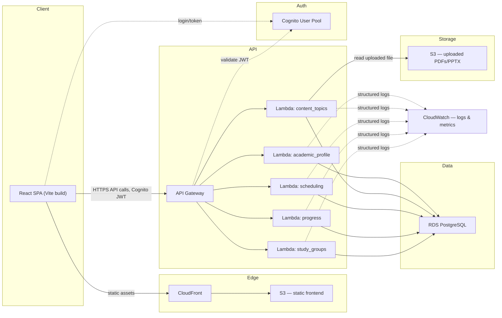

# Architecture — target AWS deployment

Component-level view of the system once the AWS phase (see [roadmap in CLAUDE.md](../../CLAUDE.md)) is built. Not the current state — see [ADR 0003](../adr/0003-local-first-then-incremental-aws.md) for what runs locally today.

Each Lambda group corresponds 1:1 to a backend feature module (`backend/src/features/*`, see [ADR 0004](../adr/0004-feature-based-backend-organization.md)) — same Application-layer use cases, deployed as a separate function per feature rather than one monolith or one function per endpoint ([ADR 0002](../adr/0002-serverless-lambda-over-containers.md)).
