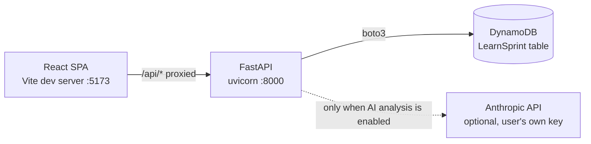
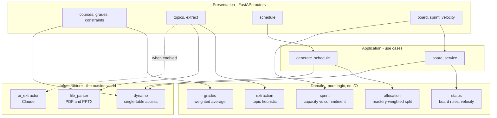
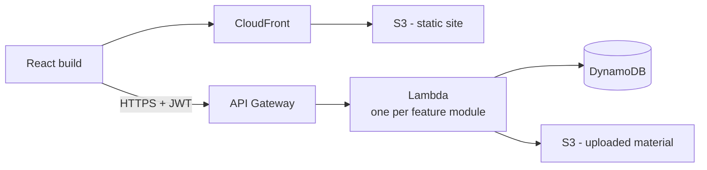

# Architecture

## What runs today

The application runs locally against real AWS DynamoDB. There is no local database — see [ADR 0006](../adr/0006-dynamodb-single-table.md).

## Inside the backend

Every feature module is layered the same way, and the dependency arrows only ever point inward — `domain` knows nothing about DynamoDB, HTTP, or Claude. That is what made the Postgres to DynamoDB migration touch only one layer.

Both graded algorithms — the mastery-weighted allocation and the sprint capacity calculation — live in `Domain`, take their inputs as plain values (including `now`), and return plain values. That is why they are directly unit-testable without a database, a clock, or a network.

## Target deployment

Not built. The roadmap position is deliberate: [ADR 0003](../adr/0003-local-first-then-incremental-aws.md) chose to build the features before the infrastructure. It reuses the serverless pattern already present in the AWS account.

Each Lambda maps 1:1 to a backend feature module ([ADR 0004](../adr/0004-feature-based-backend-organization.md)), reusing the same application and domain code — only the entry point differs, since a Lambda handler is just another Presentation-layer adapter. DynamoDB also removes the connection-pooling problem that RDS-from-Lambda would have had ([ADR 0002](../adr/0002-serverless-lambda-over-containers.md)).
