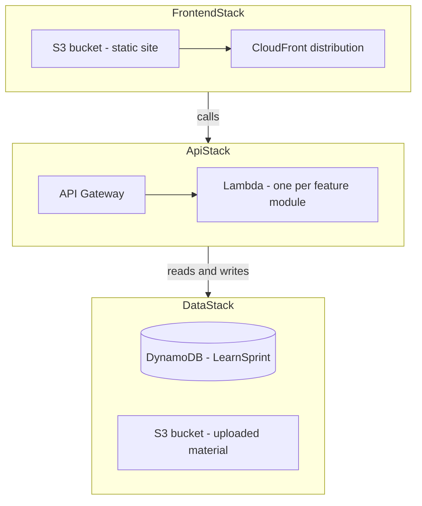

# Deployment

**Status: planned, not built.** The application currently runs locally against the real DynamoDB table. [ADR 0003](../adr/0003-local-first-then-incremental-aws.md) deliberately put the features ahead of the infrastructure, and that ordering hasn't changed.

## What exists today

| Resource | Status |
|---|---|
| DynamoDB table `LearnSprint` (on-demand, one GSI) | **Live** — the application uses it |
| Everything below | Not created |

## Target stacks

`DataStack` is the only one partly real — the table exists; the uploads bucket does not.

## Why this shape

**Lambda per feature module**, not one per endpoint and not one monolith — it mirrors the backend's existing structure ([ADR 0004](../adr/0004-feature-based-backend-organization.md)), so each function reuses the same application and domain code with only a different entry point. Reasoning in [ADR 0002](../adr/0002-serverless-lambda-over-containers.md).

**No RDS**, so there is no VPC, no subnet groups, and no Lambda connection-pooling problem — the question [ADR 0002](../adr/0002-serverless-lambda-over-containers.md) left open was dissolved rather than answered when persistence moved to DynamoDB ([ADR 0006](../adr/0006-dynamodb-single-table.md)).

**Auth stays as the application's own JWT** for now. A Cognito user pool already exists in the account from an earlier project and could replace it, but that swap only touches `shared/auth` — the rest of the code depends on the `get_current_user` dependency, not on how the token was produced.

## Known gap

The frontend currently calls the API through the Vite dev proxy at `/api`. Deploying means pointing it at the API Gateway URL and enabling CORS for the CloudFront origin. Small, but real work — not a config toggle.
