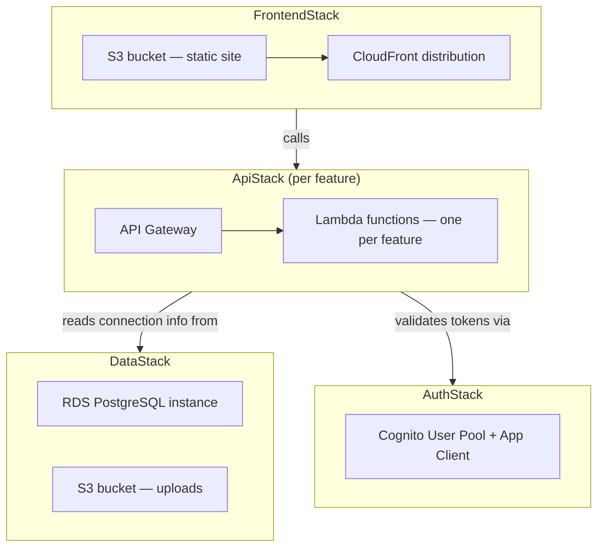

# Deployment — CDK stacks

What AWS CDK (Python) provisions, at the stack level. Built in the AWS phase of the roadmap — nothing here exists yet locally (see [ADR 0003](../adr/0003-local-first-then-incremental-aws.md)).

Each stack deploys independently via GitHub Actions (AWS OIDC, no long-lived AWS keys in CI). The frontend pipeline builds the Vite bundle, syncs it to `S3F`, and invalidates `CFD`. The backend pipeline packages each feature's Lambda and deploys via `cdk deploy` for `ApiStack`.

Stacks are introduced in the order they're needed, per the roadmap in CLAUDE.md — `FrontendStack` and a minimal `ApiStack`/`DataStack` first, `AuthStack` (Cognito) once local JWT auth is ready to be swapped out.
