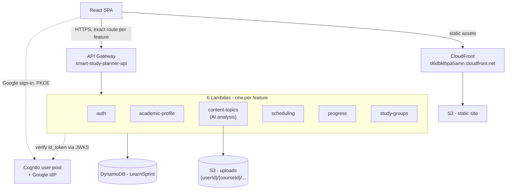

# Deployment

**Status: live.** [ADR 0008](../adr/0008-deployed-to-aws.md) covers the initial deployment; [ADR 0009](../adr/0009-split-into-per-feature-lambdas.md) covers splitting it into per-feature functions and adding per-student S3 storage for uploads.

## What's running

| Resource | Status |
|---|---|
| DynamoDB table `LearnSprint` | **Live** |
| 6 Lambda functions, one per feature | **Live** — see the table below |
| API Gateway `smart-study-planner-api` | **Live** — reused from a previous project; 31 exact routes added for this app, its original three routes untouched |
| S3 `learnsprint-frontend-835505308330` + CloudFront | **Live** |
| S3 `learnsprint-uploads-835505308330` | **Live** — one key per uploaded file, under `{userId}/{courseId}/...` |
| Cognito user pool | **Live** — reused as-is, see [ADR 0007](../adr/0007-google-sign-in-via-cognito.md) |

| Function | Owns | Routes |
|---|---|---|
| `learnsprint-auth` | `shared/auth` | `/auth/*`, `/health` |
| `learnsprint-academic-profile` | `academic_profile` | `/courses`, `/grades`, `/constraints`, `/ai-settings` |
| `learnsprint-content-topics` | `content_topics` | `/courses/{id}/topics*` — reads/writes S3, runs AI or heuristic analysis |
| `learnsprint-scheduling` | `scheduling` | `/courses/{id}/schedule*` |
| `learnsprint-progress` | `progress` | `/board`, `/sprint`, `/velocity`, progress endpoints |
| `learnsprint-study-groups` | `study_groups` | `/courses/{id}/members*` |

## Current topology

Every function runs a slim FastAPI app mounting only its own feature's router — six functions, six different code paths, not the same monolith deployed six times. `main.py` (every router mounted) still exists for local development; `backend/src/lambda_handler.py` is the only file that differs between the two, exporting one named handler per function. Nothing in a feature's router, service, or domain code changed for this split — see ADR 0009.

API Gateway matches each of the 30 routes by its exact literal path, so `GET /courses/{id}/schedule` and `GET /courses/{id}/members` route to different functions even though both share the `/courses/{id}/...` shape — no `{proxy+}` wildcard needed.

## Why this shape

**No RDS**, so there is no VPC, no subnet groups, and no Lambda connection-pooling problem — the question [ADR 0002](../adr/0002-serverless-lambda-over-containers.md) left open was dissolved rather than answered when persistence moved to DynamoDB ([ADR 0006](../adr/0006-dynamodb-single-table.md)).

**Auth is the app's own JWT plus Google through the existing Cognito user pool** ([ADR 0007](../adr/0007-google-sign-in-via-cognito.md)). No API Gateway route has an authorizer attached — the pool's existing JWT authorizer validates Cognito tokens only, and attaching it would have silently locked out every user who signed up with a password instead of Google. Every function validates both token types itself, the same way the app does locally.

**A narrower execution role for the six functions** (`learnsprint-lambda-role`, ADR 0009) than the reused `lambda_fullAccess` from ADR 0008 — scoped to exactly the `LearnSprint` table and the uploads bucket, not every table in the account. The old role stays exactly as it was, attached only to the three original Lambdas from the previous project.

**The S3 frontend bucket and CloudFront distribution are new**, not reused from the previous project. That project's custom domain doesn't resolve — its Route 53 zone has no delegation from a parent zone in this account (ADR 0008) — so this deployment uses CloudFront's own domain instead of chasing a broken one.

**Uploaded files persist per student**, one bucket with a `{userId}/{courseId}/...` key per file rather than a bucket per user — the isolation is structural through the key prefix, the same principle as DynamoDB's per-user partitions (see [docs/erd.md](../erd.md)), not a per-account bucket count nobody needs. `content_topics` writes the file to S3, then reads it back from there for analysis — not the original request bytes — so what gets analysed is provably what's on record (ADR 0009).

## Known gaps

**No CI/CD for the backend.** `deploy-frontend.yml` covers the frontend once its secrets are set (see [docs/deployment-setup.md](../deployment-setup.md)); there's no equivalent workflow for the six Lambdas yet, so a backend change still means running the packaging + `aws lambda update-function-code` steps by hand for whichever function(s) changed.

**No event-driven re-analysis.** Uploads are analysed synchronously in the same request that stores them. Re-running analysis on a previously uploaded file without re-uploading it isn't a feature yet — considered and deliberately not built in ADR 0009, since it would need the frontend to poll or subscribe for an async result for a requirement that only asked for storage and use.
