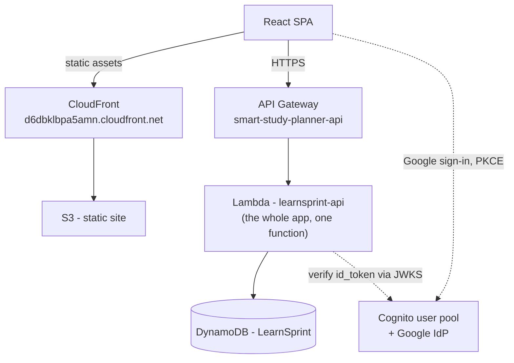

# Deployment

**Status: live.** [ADR 0008](../adr/0008-deployed-to-aws.md) covers how it was built, what was reused from a previous project, and what deploying it actually surfaced that local testing didn't.

## What's running

| Resource | Status |
|---|---|
| DynamoDB table `LearnSprint` | **Live** |
| Lambda `learnsprint-api` | **Live** — the whole FastAPI app behind `mangum`, one function |
| API Gateway `smart-study-planner-api` | **Live** — reused from a previous project; one route (`ANY /{proxy+}`) added for this app, its original three routes untouched |
| S3 `learnsprint-frontend-835505308330` + CloudFront | **Live** |
| Cognito user pool | **Live** — reused as-is, see [ADR 0007](../adr/0007-google-sign-in-via-cognito.md) |
| S3 bucket for uploaded material | Not created — uploads are parsed in memory and never persisted, so nothing needs to be stored |

## Current topology

One Lambda, not one per feature module. That was the original target (see "What was planned instead" below); it wasn't necessary to reach a working deployment, and splitting the code across five functions and IAM boundaries before any of it had run in Lambda even once would have made the first deploy harder to debug, not easier. Nothing in `main.py` or the feature routers changed for this — see `backend/src/lambda_handler.py`, the only file that exists because the app runs in Lambda instead of `uvicorn`.

## Why this shape

**No RDS**, so there is no VPC, no subnet groups, and no Lambda connection-pooling problem — the question [ADR 0002](../adr/0002-serverless-lambda-over-containers.md) left open was dissolved rather than answered when persistence moved to DynamoDB ([ADR 0006](../adr/0006-dynamodb-single-table.md)).

**Auth is the app's own JWT plus Google through the existing Cognito user pool** ([ADR 0007](../adr/0007-google-sign-in-via-cognito.md)). The API Gateway route deliberately has **no** authorizer attached — the pool's existing JWT authorizer validates Cognito tokens only, and attaching it would have silently locked out every user who signed up with a password instead of Google. The app validates both token types itself, the same way it does locally.

**The S3 bucket and CloudFront distribution are new**, not reused from the previous project. That project's custom domain doesn't resolve — its Route 53 zone has no delegation from a parent zone in this account (ADR 0008) — so this deployment uses CloudFront's own domain instead of chasing a broken one.

## What was planned instead

An earlier version of this document described five Lambdas, one per feature module (`academic_profile`, `content_topics`, `scheduling`, `progress`, `study_groups`), provisioned via CDK stacks (`FrontendStack`, `DataStack`, `ApiStack`) — mirroring the backend's feature-based code organization ([ADR 0004](../adr/0004-feature-based-backend-organization.md)) all the way into deployment. That's still a reasonable direction if the app outgrows one function — each feature module is already isolated enough that splitting it later mostly means changing entry points, not application code — but it wasn't what got built first. Reasoning for Lambda-per-feature as a target: [ADR 0002](../adr/0002-serverless-lambda-over-containers.md).

## Known gaps

**No CI/CD.** Every deploy above was run by hand from the CLI. `deploy-frontend.yml` exists but has no scoped IAM role to run under yet, and there's no backend deploy workflow at all. See [docs/deployment-setup.md](../deployment-setup.md).

**No uploads bucket**, because there's nothing to put in it yet — extracted text is processed and discarded, not the original file. If the product ever needs to re-analyze or re-download the original material, that's a real gap; it isn't one today.
