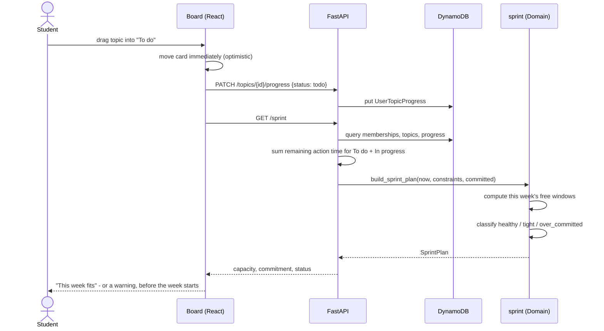
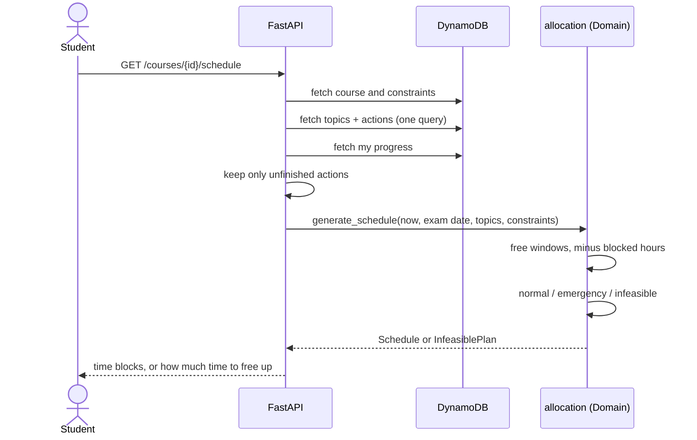
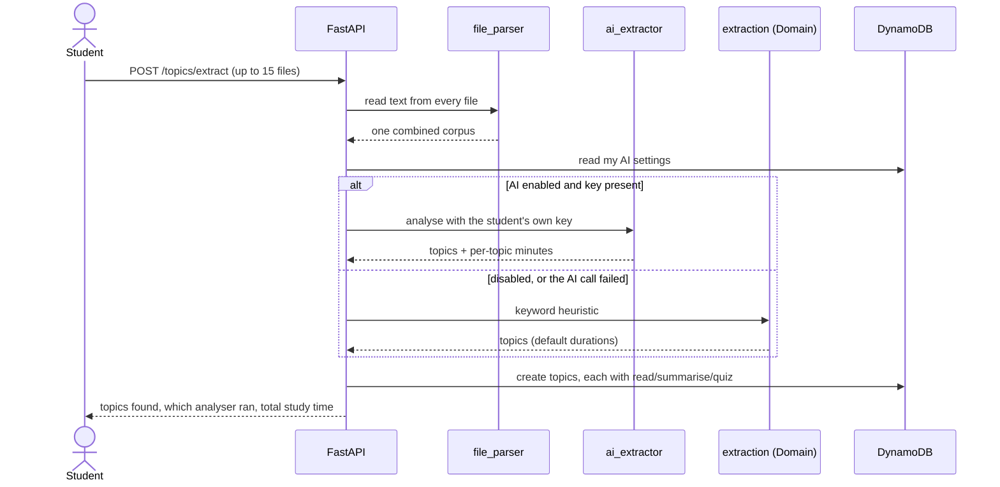

# Request flow

## Planning a sprint — the core loop

What happens when the student drags a topic into this week's sprint. This is the interaction the whole product exists for.

The card moves before the server responds, so the drag feels immediate; the reload that follows replaces the optimistic state with the derived truth.

## Generating a study plan

The schedule is computed per request and never stored ([ADR 0005](../adr/0005-schedule-not-persisted.md)), so it cannot go stale when a mastery rating changes.

## Analysing uploaded material

The fallback arm is the important one: an AI failure downgrades the quality of the estimate, never the success of the upload.
