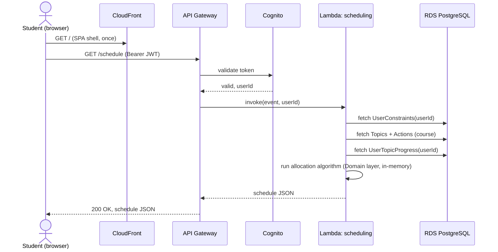

# Request flow — generate schedule

Representative request/response path for "generate my schedule" (FR3.1–FR3.3), once deployed to AWS. Locally, the same path exists minus CloudFront/API Gateway/Cognito — the browser calls FastAPI directly.

The schedule itself is never written back to `DB` — see [ADR 0005](../adr/0005-schedule-not-persisted.md).
