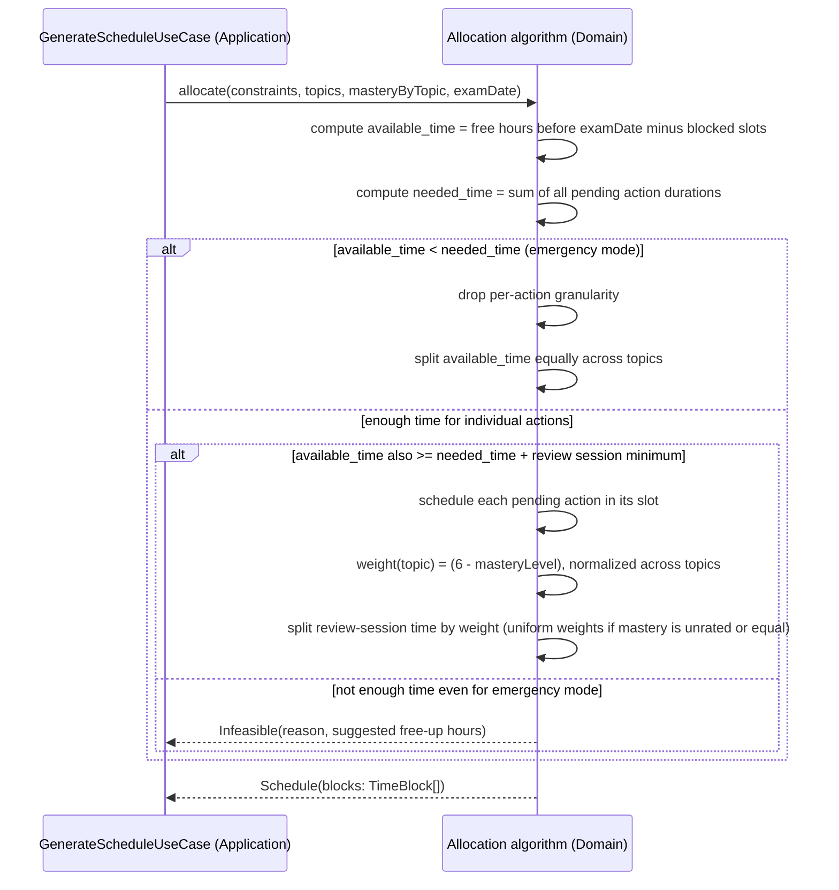

# Sequence — FR3.2 mastery-weighted allocation

Internal flow of the Domain-layer algorithm itself (the graded "significant algorithm"), independent of transport (Lambda/FastAPI) — see the `schedule-algorithm` skill for the design rules this must follow.

See [ADR 0005](../adr/0005-schedule-not-persisted.md) for why `Schedule` is returned directly and never persisted.
