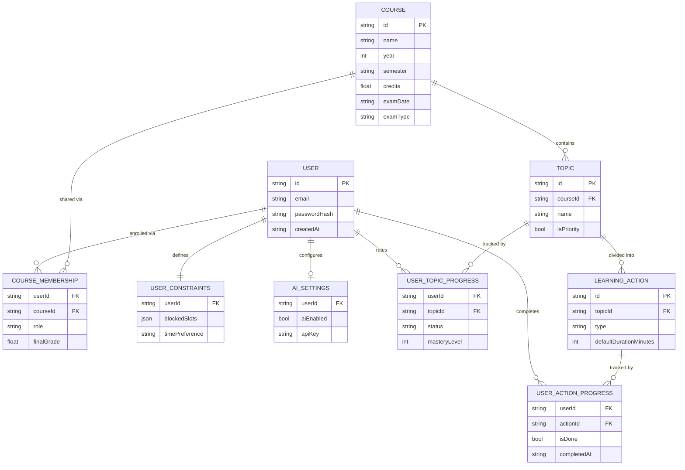

# Data model

LearnSprint stores everything in a single DynamoDB table (see [ADR 0006](adr/0006-dynamodb-single-table.md) for why DynamoDB rather than a relational database).

## Entities and relationships

The logical model first — this is what the application reasons about, independent of how it's stored:

## Shared vs. private — the rule that shapes everything

Course *content* is shared: a `Course`, its `Topic`s and their `LearningAction`s are one set of records that every enrolled student sees identically. Anything *personal* — the grade, the mastery rating, what's been completed, the blocked hours, the AI key — is stored per user.

This is a structural guarantee, not a UI filter. There is no `finalGrade` column on `Course` that we remember to hide; the grade lives on the student's own `CourseMembership` record, so there is no query that could return another student's grade by accident. The same holds for mastery ratings and progress, which is what makes the Study Groups privacy requirement (FR5.4) true by construction.

## Two ways in, one account

`USER.passwordHash` is absent for accounts created by Google sign-in — they authenticate through Cognito and have no password. Both login methods resolve to the same `USER` record by email, so nothing else in the model ever sees which one was used ([ADR 0007](adr/0007-google-sign-in-via-cognito.md)).

## Single-table key design

DynamoDB has one table with a composite key (`PK`, `SK`) plus one global secondary index. Item type is chosen by the key prefix:

| Entity | PK | SK | GSI1PK | GSI1SK |
|---|---|---|---|---|
| User | `USER#<userId>` | `PROFILE` | `EMAIL#<email>` | `USER#<userId>` |
| UserConstraints | `USER#<userId>` | `CONSTRAINTS` | — | — |
| AiSettings | `USER#<userId>` | `AI_SETTINGS` | — | — |
| CourseMembership | `USER#<userId>` | `COURSE#<courseId>` | `COURSE#<courseId>` | `USER#<userId>` |
| UserTopicProgress | `USER#<userId>` | `TPROG#<topicId>` | — | — |
| UserActionProgress | `USER#<userId>` | `APROG#<actionId>` | — | — |
| Course | `COURSE#<courseId>` | `META` | — | — |
| Topic | `COURSE#<courseId>` | `TOPIC#<topicId>` | — | — |
| LearningAction | `COURSE#<courseId>` | `TOPIC#<topicId>#ACTION#<actionId>` | — | — |

Two deliberate choices in that layout:

**Everything a user privately owns shares one partition** (`USER#<id>`), so "my courses", "my progress", and "my constraints" are each a single query with an SK prefix rather than a scan.

**A course's whole content tree shares one partition** (`COURSE#<id>`), and actions sort immediately after their topic because their SK starts with the topic's SK. Loading a course with all its topics and actions is therefore *one* query, not one per topic.

## Access patterns

Every query the application makes, and how the keys serve it:

| Access pattern | How |
|---|---|
| Log in by email | GSI1 query on `EMAIL#<email>` — login only knows the email, not the user id |
| Load my courses | Query `PK=USER#<id>`, `SK` begins with `COURSE#` |
| Load a course's topics and actions | Query `PK=COURSE#<id>` — returns the whole tree at once |
| Load my progress | Query `PK=USER#<id>`, `SK` begins with `TPROG#` / `APROG#` |
| List a course's members (FR5.3) | GSI1 query on `COURSE#<id>` — the reverse of the membership record |
| Compute my weighted average | Query my memberships; course name, credits and semester are denormalised onto each membership record, so no second lookup is needed |

## Denormalisation

`CourseMembership` carries a copy of the course's `name`, `year`, `semester`, `credits`, `examDate` and `examType`. This is deliberate: the courses list and the grades page need those fields for every course, and without the copy each page would need one additional lookup per course. `update_course` refreshes the copies on every membership, which is the cost of the trade.

## Uploaded material lives in S3, not DynamoDB

Course files a student uploads are stored in a separate bucket (`learnsprint-uploads-835505308330`, deployed - see [ADR 0009](adr/0009-split-into-per-feature-lambdas.md)), one object per file, keyed `{userId}/{courseId}/{uuid}-{filename}`. There is no DynamoDB record of the upload — no key beyond the S3 key itself, since nothing yet needs to list or re-analyse past uploads. The prefix is the same private-per-user pattern as everything else here: a student's files sit under their own `userId`, structurally apart from anyone else's, the same way their `UserTopicProgress` rows do.

## What is *not* stored

**The generated schedule.** FR3.1–FR3.3 produce time blocks, and those are computed on demand and returned — never written back. See [ADR 0005](adr/0005-schedule-not-persisted.md).

**Sprint state.** A sprint isn't a record either. It's derived: the week is computed from the current date, capacity from `UserConstraints`, and the commitment from whichever topics currently sit in `todo` / `in_progress`. Moving a card *is* changing the sprint, so there is nothing separate to keep in sync.
