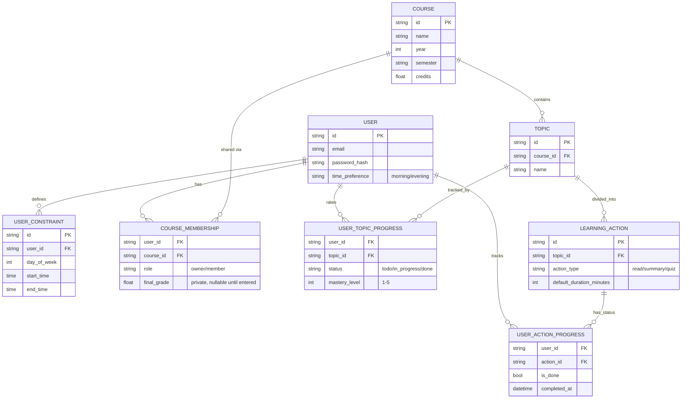

# Entity-Relationship Diagram

This is the authoritative data model for Study Planner. It must stay in sync with the Data Dictionary in [../CLAUDE.md](../CLAUDE.md).

## Key decisions baked into this model

- **Shared vs. private is modeled as separate tables, not a flag.** `COURSE`, `TOPIC`, and `LEARNING_ACTION` hold only content that every group member sees identically. Anything personal — grade, mastery rating, completion status, time constraints — lives in a table keyed by `user_id`, even for a solo (non-grouped) course.
- **No standalone `STUDY_GROUP` entity.** A "group" is just the set of `COURSE_MEMBERSHIP` rows for a course. One course ↔ one implicit group. If the project ever needs multiple independent groups around the same course, this will need to split — not needed for the current FRs.
- **Ownership and grade merged into `COURSE_MEMBERSHIP`.** Every user who can see a course — including a solo user with no groupmates — has exactly one `COURSE_MEMBERSHIP` row, holding their `role` and their personal `final_grade`. This is also what enforces FR5.4 (grades are per-row, per-user, never a field on the shared `COURSE`).
- **The generated schedule is *not* persisted.** It's a pure Domain-layer output, recomputed from `USER_CONSTRAINT`, `USER_TOPIC_PROGRESS.mastery_level`, and the shared topic/action list. NFR2 already requires recompute in under 2 seconds, which is what makes "always recompute, never store" viable — it also sidesteps having to invalidate/sync a stored schedule whenever a shared topic changes under a group member. If the project later needs schedule history (e.g. "what was I told to do last Tuesday"), that would be a separate, explicitly-versioned snapshot table — not needed for FR3.x as currently scoped.

## Diagram

## What changed from the first draft, and why

| Original | Problem | Fix |
|---|---|---|
| `TOPIC.difficulty_rating` | Shared field, but mastery is per-student (FR2.4) — would force group members to share one rating | Moved to `USER_TOPIC_PROGRESS.mastery_level`, keyed by `(user_id, topic_id)` |
| `COURSE.final_grade` | Shared field on a row multiple group members can access — directly violates FR5.4 (grades must stay private) | Moved to `COURSE_MEMBERSHIP.final_grade`, one row per `(user_id, course_id)` |
| `COURSE.user_id "Owner"` + separate `STUDY_GROUP_MEMBERSHIP` | Ownership represented in two places | Merged: ownership is just `COURSE_MEMBERSHIP.role = 'owner'` |
| `USER_PROGRESS` (action-level only) | No entity carried topic-level status/mastery (FR2.4, FR2.5 both need topic granularity, not just action) | Split into `USER_TOPIC_PROGRESS` (status + mastery, per topic) and `USER_ACTION_PROGRESS` (done/not, per action) |
| No schedule entity | FR3.1–FR3.3 output (actual time blocks) wasn't represented anywhere | Deliberately *not* modeled as a table — see "generated schedule is not persisted" above |
